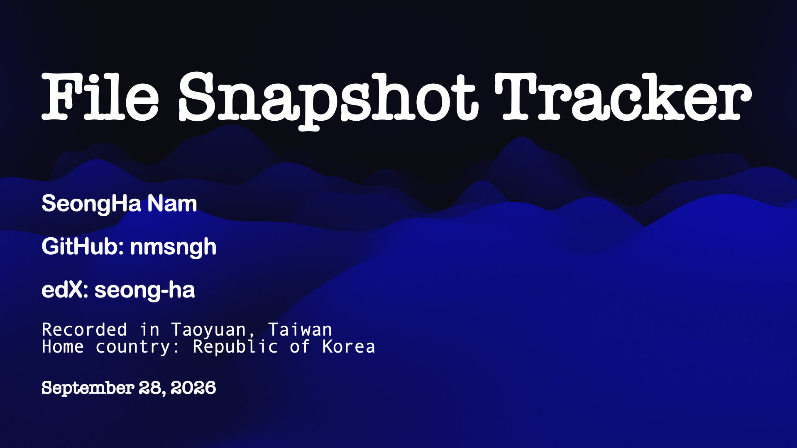

# File Snapshot Tracker

<p align="center">
  
</p>


#### Video Demo: ><><><


#### Description:

File Snapshot Tracker is a local web application that records snapshots of a directory and helps users understand how its files change over time. The project was created as my final project for CS50x.

The application is designed for situations where a user wants a lightweight record of a project folder, study materials, or another local directory. Instead of continuously monitoring a computer in the background, it uses manual scans. A user registers a local directory path, runs a scan when desired, and the application saves a snapshot of the files that were accessible at that moment. Later scans can be compared with previous snapshots to identify added, modified, renamed, and deleted files.

This is intentionally a local-only tool. It runs through Flask on the user's own computer and stores its data in a local SQLite database. The application does not upload the registered directory or file contents to an external server. Only file metadata and SHA-256 hashes are stored in the tracker database.


## Features

The main features of File Snapshot Tracker are:

- Register a local directory with an optional label.
- Validate that a submitted path exists and is a directory.
- Remove a registered directory and its stored tracker history without deleting the real files on the computer.
- Manually scan a directory recursively.
- Store a separate snapshot for every scan.
- Track each file's relative path, size, modification time, and SHA-256 hash.
- Compare the two most recent snapshots.
- Reopen comparisons between historical snapshots.
- Detect `Added`, `Modified`, `Removed`, and possible `Renamed` events.
- Display scan history with file-count and total-size changes.
- Display an all-recorded-events timeline across every consecutive scan.
- Export full scan history and change history as CSV and JSON files.
- Provide a styled web interface for registered directories, comparisons, history, and exports.


## How It Works

When the user presses **Scan now**, the application recursively visits the selected directory. It ignores symbolic links and skips files that cannot be read because of an operating-system error or permission restriction. For every readable file, the application stores:

- the relative path from the registered directory;
- file size in bytes;
- last modification time;
- SHA-256 hash of the file contents.

The tracker creates a new snapshot rather than overwriting an older scan. This makes it possible to compare the current state with the previous state and to inspect changes from earlier points in time.

A file is considered `Modified` when its path remains the same but its SHA-256 hash changes. Using a hash is more reliable than comparing only file size or modification time, because a file can be changed without changing its size.

A file is considered `Renamed` when a deleted file and an added file have the same SHA-256 hash between two consecutive snapshots. This means the application has evidence that the same content disappeared from one path and appeared at another path.

The application also provides two different ways to inspect history:

1. **Compare final states** compares two selected snapshots and shows the net difference between them.
2. **View all recorded events** compares every consecutive pair of snapshots from the first scan to the latest scan. This preserves intermediate events, such as a file being modified and later deleted.

The second option is important because a final-state comparison cannot show every event that happened in the middle of a long time range. For example, a file may be created, renamed, modified, and deleted before the final snapshot. Comparing only the first and final snapshots would not contain enough information to reconstruct every intermediate event.


## Project Files

### `app.py`

`app.py` is the main Flask application. It defines the web routes, initializes the database, registers directories, starts scans, loads snapshot history, renders templates, handles exports, and removes registered directories.

It also contains helper functions used by the routes. For example, `get_range_events` loads all snapshots within a directory's history and compares each consecutive pair in order to create the complete event timeline.

The application stores the time of each scan and displays it in the user's local timezone. Older records created with SQLite's default UTC timestamp are converted to local time when they are displayed.

### `database.py`

`database.py` manages SQLite connections and database initialization. The database contains three main tables:

- `watched_directories`: registered directory paths, labels, and creation times;
- `snapshots`: one record per scan, including scan time, file count, and total size;
- `file_entries`: one record per file in a specific snapshot, including metadata and the SHA-256 hash.

When a user removes a registered directory, the application deletes only the tracking records stored in its SQLite database. The actual folder and files on the user's computer are never deleted.

### `scanner.py`

`scanner.py` contains the filesystem scanning logic. It uses `pathlib.Path` to recursively inspect a registered directory. It skips symbolic links and handles `OSError` exceptions so that inaccessible files do not stop an entire scan.

The module calculates SHA-256 hashes in chunks instead of reading every file into memory at once. This is a more reasonable approach for larger files and demonstrates how file hashing can be used to verify file-content identity.

### `comparison.py`

`comparison.py` compares file entries from two snapshots. It identifies added files, deleted files, and modified files. It also performs hash-based rename detection by matching the hashes of added and deleted files.

The comparison logic is separated from Flask route logic so that the change-detection behavior remains easier to understand, test, and reuse.

### `templates/`

The `templates` directory contains the Jinja HTML templates for the web interface.

- `layout.html` is the shared base layout. It includes the page header, navigation link, flash messages, stylesheet, and JavaScript file.
- `index.html` displays the dashboard, directory registration form, registered directories, scan buttons, history links, export links, and removal controls.
- `changes.html` displays snapshot comparison results.
- `history.html` displays all scans for one registered directory and allows the user to select two snapshots for a final-state comparison.
- `events.html` displays the complete chronological event history from the first recorded snapshot through the latest snapshot.

### `static/style.css`

`static/style.css` contains the visual design of the application. It defines shared styles for cards, tables, buttons, forms, status badges, flash messages, responsive layout, and empty states.

### `static/app.js`

`static/app.js` contains small client-side JavaScript features used by the comparison interface, including file-path searching and filtering comparison results by status.

### `requirements.txt`

`requirements.txt` lists the Python packages required to run the project, including Flask and its dependencies.


## Rename Detection Design Decision

The application detects a possible rename by matching the SHA-256 hash of a newly added file with the hash of a deleted file between two consecutive snapshots. If the file content is unchanged, the application can classify the event as `Renamed`.

However, if a file is renamed and its content is modified before the next scan, its SHA-256 hash also changes. In that case, the application cannot reliably prove that the new file is the same file under a new name. It therefore reports one `Removed` event and one `Added` event instead of `Renamed`.


## Limitations and Platform Permissions

Because this is a local filesystem application, it can only scan paths that the program running Flask is allowed to access. On macOS, folders such as Documents, Desktop, Downloads, iCloud Drive, or other protected locations may require additional permission for the application that launches Python, such as Terminal or Visual Studio Code.

A directory containing no accessible files may appear to contain zero files if the operating system prevents access. The application does not bypass operating-system permissions.


## Installation and Usage

1. Clone this Repository

2. Open the terminal of the downloaded folder

3. Create and activate a Python virtual environment:

```bash
python3 -m venv .venv
source .venv/bin/activate
```

Install the required packages:

```bash
pip install -r requirements.txt
```

Run the application:

```bash
python app.py
```

Then open the local address shown in the terminal, normally:

```text
http://127.0.0.1:5000
```


## To use the application:

1. Enter a local directory path and an optional label.
2. Register the directory.
3. Click **Scan now** to create the first snapshot.
4. Add, modify, rename, or delete files in the real directory.
5. Run another scan.
6. Open **View latest changes**, **View scan history**, or **View all recorded events**.
7. Download CSV or JSON exports if desired.


## AI Assistance Disclosure (Harvard CS50x - Final Project)

AI assistance was used as a learning aid during development. In particular, the initial Flask route structure and SQLite interaction structure were developed with AI assistance like ChatGPT, then reviewed, tested, and adapted by the author. The final design decisions, implementation, testing, and documentation were completed and verified by the author.